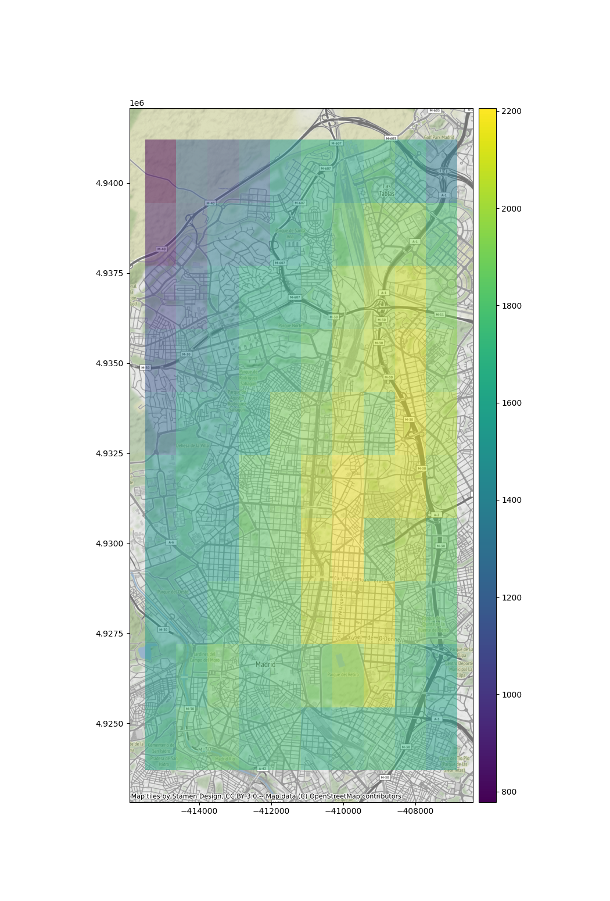
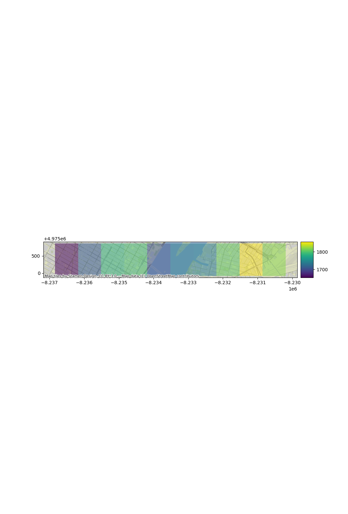

# Project FocusLugar

Tool to find the optimal location of an office for a new company

## Introduction

The tool evaluates any point as a propouse place to ubicate the head office. It 
defines an objective function that depend on the following ad-hoc caractheristics:

- Nearby of companies of design.
- Nearby of a kindergarden
- Nearby successful tech startups that have raised at least 1 Million dollars.
- Nearby Starbucks.
- Facility to travel
- Nearby some places to party.
- Not companies with more than 10 years in a radius of 2 KM.
- Vegan restaurant.

## The data

The origin of data are:

* API Maps, de google maps: 
	- Kindergarden near the point of interest
	- Nearest Airport 
	- Sturbucks
	- Basquetball courts
	- Vegan restaurant

* BD of companies: 18k companies all over the world, it was used to get the location of:
	- Companies of Design.
	- Success startup that have raised more than 1 millon dollars.
	- Companies with more than 10 years. 

## The Search

a) The tool define an objective function, that follow:

1. How, given a point, it accomplish the following requirements:
	- Designers like to go to design talks and share knowledge. There must be some nearby companies that also do design.
	- 30% of the company have at least 1 child.
	- Developers like to be near successful tech startups that have raised at least 1 Million dollars.
	- Executives like Starbucks A LOT. Ensure there's a starbucks not to far.
	- Account managers need to travel a lot
	- All people in the company have between 25 and 40 years, give them some place to go to party.	
	- Nobody in the company likes to have companies with more than 10 years in a radius of 2 KM.
	- The CEO is Vegan

2. Then valuate all this requeriments with the quantity of personal affected, depend on the following distribution:

	- 20 Designers
	- 5 UI/UX Engineers
	- 10 Frontend Developers
	- 15 Data Engineers
	- 5 Backend Developers
	- 20 Account Managers
	- 1 Maintenance guy that loves basketball
	- 10 Executives
	- 1 CEO/President

	and how each of the personal makes grow the company. 

b) Over this function the tool proposes some points and begin iterate over the function until the stop criteria. 
Initially the optimization was iterative (gradient method), but with each time we call our objective function, 
were neccesary to call the API of google at less nine times, and to calculate the gradient in each iteration is neccesary 
to call the the objective function four times. And probably the library `numdifftools`used to calculate the gradient made this
calls parallel and the google API can not answer.

c) As a solution the heuristic method for optimization is to create a mesh over each city and determinate in this way the 
best location for the company.

## The Results

As you can see in the maps, there are some areas in the city that are more suitable for the company.

#### Map of Madrid

#### Map of New York

